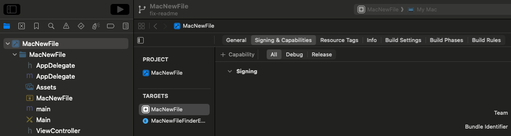
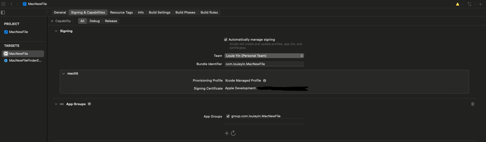
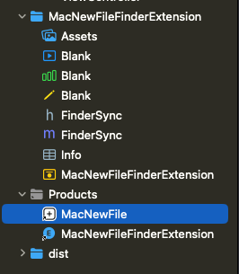

<div align="center">


# MacNewFile
[](https://github.com/GarfieldFluffJr/MacNewFile/blob/main/LICENSE)

[](https://brew.sh/)
[](https://github.com/GarfieldFluffJr/MacNewFile/releases)


[](https://github.com/GarfieldFluffJr/MacNewFile/stargazers)

</div>

One of the many things that pissed me off after switching from Windows to Mac was that I couldn't create a new text file or word document off of a right click in Finder (file explorer).

So I made **MacNewFile**!!

MacNewFile is lightweight and simple. You right click anywhere in Finder (or on your desktop) and you get a menu to create new files!

<div align="center">

</div>

**Please note:** This only doesn't work on directories inside of your iCloud, since Apple fully removed support for FinderSync in 2019.

## Features
- Can create the following apps from the Finder right-click menu:
    - Text file
    - Markdown file
    - Microsoft Word, Excel, and Powerpoint
    - Apple Pages, Numbers, and Keynote

- Settings menu to customize MacNewFile features (**ONLY IN XCODE FORK INSTALL** - more info later)

- Can **copy the filepath** of the current directory

- Can **open a new terminal** in the current directory

- Light/dark mode compatible

- To disable the app (fully stop running in the background), click the MacNewFile app icon in the top menu bar (plus sign) and click "Quit"
    - Or you can go to `System Settings -> General -> Login & Extensions -> File Providers / File System Extensions` and find MacNewFile and turn it off

# Installation

- **[Homebrew (Recommended) [v3.0.0]](#homebrew)**
- **[Manual Download [v3.0.0]](#manual-download)**
- **[Manual Download [All Features]](#manual-download-all-features)**

v3.0.0 contains all functionality except for the settings modal which allows you to customize your right-click menu and which features you would like to enable/disable. This is because Apple Security requires notarization so it blocks certain API features (settings modal) unless I pay them. This is also why manual installation prompts so many privacy and security flags.

If you would like the full version of this app, then click the link to manually download all features, which requires a few extra steps but are not difficult and is the only workaround I can think of.

## Homebrew

### Install
```zsh
brew tap GarfieldFluffJr/macnewfile
brew install --cask macnewfile
```

### Update
```zsh
brew update
brew upgrade --cask macnewfile
```

### Complete uninstall
```zsh
brew uninstall --cask macnewfile
brew untap GarfieldFluffJr/macnewfile
```

- **[Jump to Debugging](#debugging)**
- **[Jump to Contributions and Issues](#contributions-and-issues)**

## Manual Download

### Install

1. **[Download `MacNewFile.zip` in the latest release](https://github.com/GarfieldFluffJr/MacNewFile/releases)**

2. Unzip the folder, delete the zip folder, and move `MacNewFile.app` to the `Applications` folder

3. Run `MacNewFile.app`
    - If prompted with Apple Security, open system settings, open `Privacy and Security`, scroll all the way to the bottom and click "open anyways"

4. Run `MacNewFile.app` again from the `Applications` folder

The reason for the many security concerns is because Apple is very strict on what apps may do, so I made exceptions that allows MacNewFile to create new apps in arbitrary locations. I also don't have Apple Developer Notarization.

### Uninstall

Delete the `MacNewFile.app` file in the `Applications` folder.

You can delete with `AppCleaner` which will delete the tiny Finder extension bundles installed (~50KB)

### Update

Uninstall the current version and install the new version manually

- **[Jump to Debugging](#debugging)**
- **[Jump to Contributions and Issues](#contributions-and-issues)**

## Manual Download All Features

### Install

For all files installed, try to keep them somewhere you remember so it's easy to delete when finished (like Downloads folder)

1. Install Xcode
    - [App Store (Recommended)](https://apps.apple.com/us/app/xcode/id497799835?mt=12)
    - [Older versions (Requires Apple ID)](https://developer.apple.com/download/all/?q=xcode) - Open in Incognito tab if it keeps redirecting you back to your account
    - [Which version of Xcode to install?](https://developer.apple.com/support/xcode/)

2. Fork this repository

3. Open Xcode and clone your forked repository and checkout into the `new-version` branch

4. Click `MacNewFile` -> `Signing  & Capabilities` 

    

    Ensure MacNewFile is selected under `Targets`

5. Change the `Team` field to your own Apple ID. Change the `Bundle Identifier` from `louieyin` to your own first and last name. Then, under `App Groups`, uncheck mine and add your own in the same format, just replacing `louieyin` to your own name.

    - This is a security feature implemented by Apple,  so they know who is using their services, and since you're building my app locally, you use your own account

    - Everything will work fine if nothing is highlighted red

        

6. Change the `Target` to `MacNewFileFinderExtension` and repeat the exact same steps with the same names as step 5 

    

7. In `MacNewFile/AppDelegate.m`, modify lines `11` and `240` to use your name that you used in steps 5 and 6 instead of mine.

8. In `MacNewFileFinderExtension/FinderSync.m`, modify line `10` similarly to step 7.

Now it's time to build the working version locally!

9. `Menu Bar -> Product -> Clean Build Folder` (cmd + shift + K)

10. `Menu Bar -> Product -> Build` (cmd + B)

11. Right click `Products/MacNewFile.app` and select `Show in Finder` 

    

12. Move it to the `Applications` folder and open it

    - If it doesn't open or work, **[jump to debugging](#debugging)**

13. Congratulations! You have installed the fully working version of MacNewFile! You can now safely delete Xcode and all other files installed (check your `Recents` folder or where you saved everything upon installation)

## Update

Uninstall the current app in `Applications` and follow the steps to install the new version again.

## Uninstall

Just delete the app in `Applications`. You may use choose to use`AppCleaner` to delete any bundles installed (~50KB).

## Debugging
- Move app out of quarantine: `xattr -dr com.apple.quarantine /Applications/MacNewFile.app`

- Restart Finder: `killall Finder`

- Go through Settings Privacy and Security

## Contributions and Issues

Do you have a new idea you want to implement? Feel free to contribute! 

Fork the repository and make the project your own. Or, if you'd like to contribute to this project, submit a pull request when you're done. See **[CONTRIBUTING.md](./CONTRIBUTING.md)** for more details.

Or if you'd like to **suggest changes**, **[submit a github issue](https://github.com/GarfieldFluffJr/MacNewFile/issues)**.

You can also reach me by email if you have any questions: **louieyin6@gmail.com**

## My Promise as a Developer

- **I don't vibe-code my projects**

- This is not malware, everything is pushed to this repo which you can review

- It is **very easy to install and delete**, I steal no data, or hide anything on your device

- This app does not hide in the background, I tested this with my own MacBook, Activity Monitor shows no activity once the application is quit

    - You can view if it is running in `System Settings -> General -> Login Items & Extensions -> File Providers / File System Extensions`

- I try to be as transparent as possible, and explain why certain security bypasses or unorthodox installation methods are necessary.

- **My projects are fully Open Source**. I don't make my projects cost any money to my users. MacOS and Apple in general lacks an open source community and I hope to make it better. Despite Apple requiring almost every developer to pay $100 USD per year just to develop (which is outrageous), I will do whatever I can to keep developing and distributing for free and bypass these ridiculous Apple security requirements.

## Support

Thanks for making it this far in the readme. If you found this tool particularly useful for you, please consider giving me a star on github, it's free and means a lot to me.

You can also choose to [Buy me a Coffee](https://buymeacoffee.com/garfieldfluffjr) if you really think I made a positive impact on you.

## License

GNU GPL v3 License - see [LICENSE](./LICENSE) for details.
